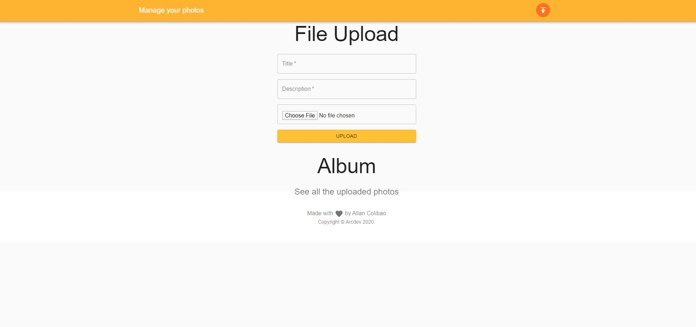
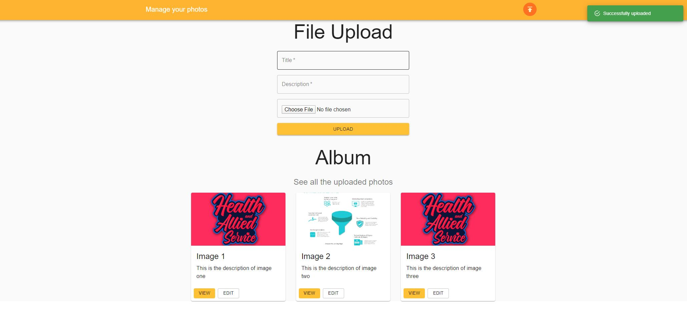
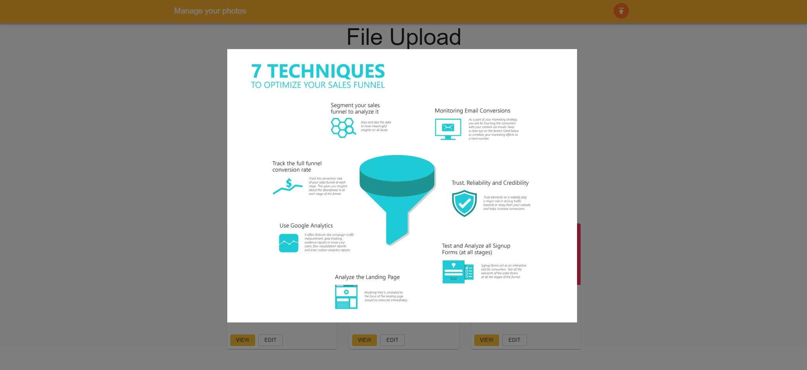
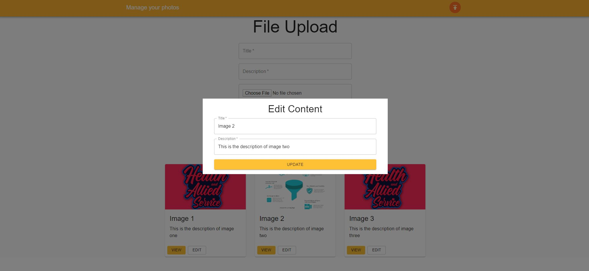
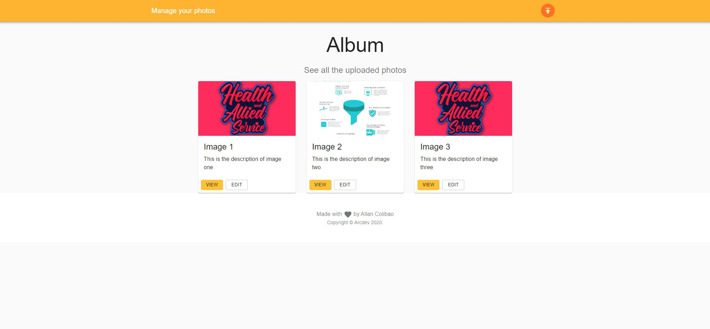

## About this application
Upload, view and edit description of your photos.

## Here the few easy steps

1. Clone or download the repository.
2. Create a env file by running
    - cp .env.example .env
    - php artisan key:generate
3. Setup your database in mysql and env.file (depth is the default name)
4. Run php artisan config:cache
5. Run php artisan migrate
6. Lastly, php artisan serve

## Sample Screenshots

Thank you!

@arcdev

See [My Portfolio](https://arcdev.me).